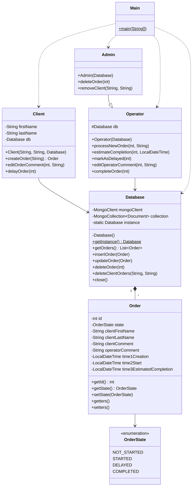

```mermaid
classDiagram
    class OrderState {
        <<enumeration>>
        NOT_STARTED
        STARTED
        DELAYED
        COMPLETED
    }

    class Order {
        -int id
        -OrderState state
        -String clientFirstName
        -String clientLastName
        -String clientComment
        -String operatorComment
        -LocalDateTime time1Creation
        -LocalDateTime time2Start
        -LocalDateTime time3EstimatedCompletion
        +getId() int
        +getState() OrderState
        +setState(OrderState)
        +getters()
        +setters()
    }

    class Database {
        -MongoClient mongoClient
        -MongoCollection~Document~ collection
        -static Database instance
        -Database()
        +getInstance() Database$
        +getOrders() List~Order~
        +insertOrder(Order)
        +updateOrder(Order)
        +deleteOrder(int)
        +deleteClientOrders(String, String)
        +close()
    }

    class Client {
        -String firstName
        -String lastName
        -Database db
        +Client(String, String, Database)
        +createOrder(String) Order
        +editOrderComment(int, String)
        +delayOrder(int)
    }

    class Operator {
        #Database db
        +Operator(Database)
        +processNewOrder(int, String)
        +estimateCompletion(int, LocalDateTime)
        +markAsDelayed(int)
        +editOperatorComment(int, String)
        +completeOrder(int)
    }

    class Admin {
        +Admin(Database)
        +deleteOrder(int)
        +removeClient(String, String)
    }

    class Main {
        +main(String[])$
    }

    %% Relacje (zgodne z UML wygenerowanym dla diagrams.net)
    Order --> OrderState
    Database "1" *-- "*" Order
    Client --> Database
    Operator --> Database
    Admin --|> Operator
    Main ..> Database
    Main ..> Client
    Main ..> Admin
    Main ..> Operator
```