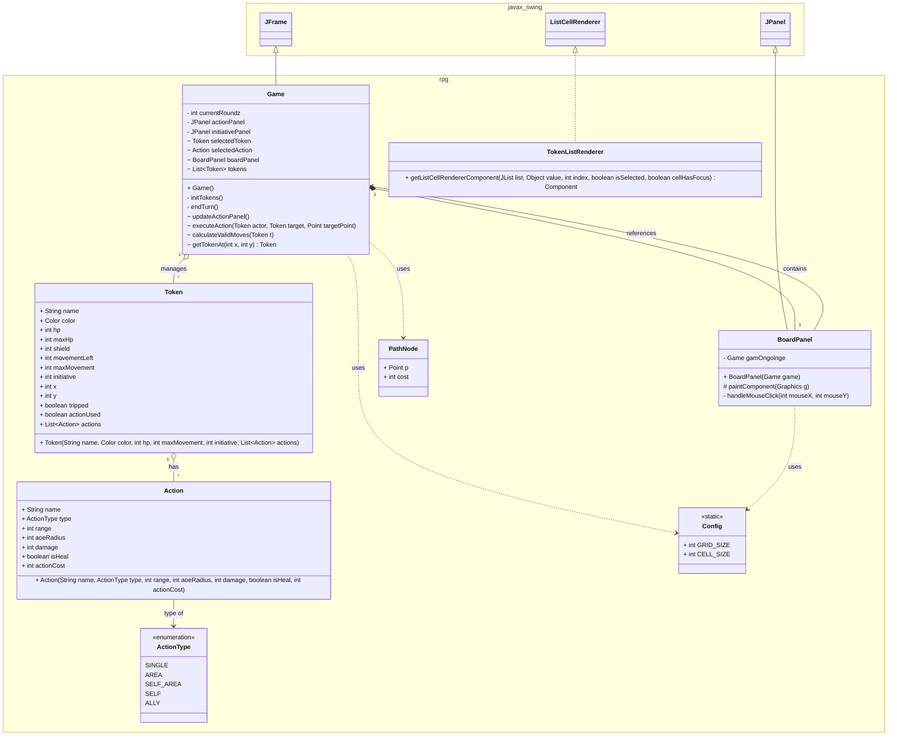

# RPG Game Class Diagram

```mermaid
classDiagram
    namespace javax_swing {
        class JFrame
        class JPanel
        class ListCellRenderer
    }

    namespace rpg {
        class Game {
            - int currentRoundz
            - JPanel actionPanel
            - JPanel initiativePanel
            ~ Token selectedToken
            ~ Action selectedAction
            ~ BoardPanel boardPanel
            ~ List~Token~ tokens
            + Game()
            - initTokens()
            - endTurn()
            ~ updateActionPanel()
            ~ executeAction(Token actor, Token target, Point targetPoint)
            ~ calculateValidMoves(Token t)
            ~ getTokenAt(int x, int y) Token
        }

        class BoardPanel {
            - Game gamOngoinge
            + BoardPanel(Game game)
            # paintComponent(Graphics g)
            - handleMouseClick(int mouseX, int mouseY)
        }

        class TokenListRenderer {
            + getListCellRendererComponent(JList list, Object value, int index, boolean isSelected, boolean cellHasFocus) Component
        }

        class Token {
            + String name
            + Color color
            + int hp
            + int maxHp
            + int shield
            + int movementLeft
            + int maxMovement
            + int initiative
            + int x
            + int y
            + boolean tripped
            + boolean actionUsed
            + List~Action~ actions
            + Token(String name, Color color, int hp, int maxMovement, int initiative, List~Action~ actions)
        }

        class Action {
            + String name
            + ActionType type
            + int range
            + int aoeRadius
            + int damage
            + boolean isHeal
            + int actionCost
            + Action(String name, ActionType type, int range, int aoeRadius, int damage, boolean isHeal, int actionCost)
        }

        class ActionType {
            <<enumeration>>
            SINGLE
            AREA
            SELF_AREA
            SELF
            ALLY
        }

        class PathNode {
            + Point p
            + int cost
        }

        class Config {
            <<static>>
            + int GRID_SIZE
            + int CELL_SIZE
        }
    }

    %% External Interface Relationships (Swing)
    JFrame <|-- Game
    JPanel <|-- BoardPanel
    ListCellRenderer <|.. TokenListRenderer

    %% Internal Data Structural Relationships
    Game "1" *-- "1" BoardPanel : contains
    Game "1" o-- "*" Token : manages
    BoardPanel --> Game : references
    Token "1" o-- "*" Action : has
    Action --> ActionType : type of
    Game ..> PathNode : uses
    Game ..> Config : uses
    BoardPanel ..> Config : uses
```
